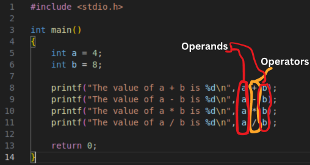

# Instructions and operators

## Mostly there are 3 types of instructions in C
### 1. Type declaration instructions
Like ``` int ```, ``` float```, ``` char``` etc.
### 2. Arithmetic Instructions
Like ``` +``` (plus), ``` -``` (minus), ``` *``` (multiplication) etc.
### 3. Control Flow instructions
Like ```for loop```, ``` while loop``` etc. which tell what to execute first.

## Type declaration operators in action
You can see <a href="./Instructions/type-declaration-instructions.c">``` type-declaration-instructions.c``` File by click here. </a>

## Arithmatic instructions in action
You can see <a href="./Instructions/airthmatic-instructions.c">``` airthmatic-instructions.c``` File by clicking here. </a>
### Operators and operands


### Modular division operator (```%```)
Used to get the remainder of division

#### Rules for Modular division opeator
1. It returns the remainder.
2. It does not work on floats
3. Sign should be the same as the numerator.(-5 % 2 = 1)
    3.1. 5 % 2 = 1
    3.2. -5 % 2 = -1

### Important
#### No operator is assumed to be present.
Means:
```C
printf("The product of 4 and 5 is %d", 4.5);
printf("The product of 4 and 5 is %d", (4)5);
printf("The product of 4 and 5 is %d", 4.(5));
printf("The product of 4 and 5 is %d", (4)(5));
printf("The product of 4 and 5 is %d", (4)*(5));
```
Are all errors because in regular mathematics we expect all of these operators to multiply those 2 numbers.
But in C only this is the correct way:
```C
printf("The product of 4 and 5 is %d", 4*5);
```

#### No operator to perform exponentiation.
In many programming languages there are exponentition operators. Like in Python:
```Py
a = 2**3
```
Retrns 2^3 which is 8 (2*2*2 = 8).

But in C, there is no exponentition operator.
But if we really want to do exponentiation in C, we can do this:

First include ```<math.h>```:
```C
# include <math.h>
```

Then use the ```pow()``` function:
```C
printf("4 to the power 5 is %f", pow(4, 5));
```

### How division works in C
Int / Int = Int
Int / Float = Float
Float / Float = Float

5/2 = 2
2/5 = 0
5/0.2 = 2.5
2.0/5 = 0.4


### Note
```C
int a = 3.5;
```
```a``` will be rounded to 3 (demotion) because it is an ```int```. <br>
And
```C
float b = 8;
```
```b``` will be promoted to 8.0 because it a ```float```

### Quick Quiz
What will be the value of ```k``` in this code?
```C
int k = 3.0/9;
```

Try to answer it on your own.
#### Answer
Let's first evaluate 3.0/9, it will be 0.333333.... <br>

Now because ```k``` is an ```int```, 0.3333333.... will be rounded off (demoted to) 0.

### Operator preccedense
Now take a look at <a href="./Instructions/Operators/operator_precedense.c">/Instructions/Operators/operator_precedense.c </a>

<br>
In C language mathematical rules like BODMAS no longer apply.
The answer is provided by operator precedence and assosiativity.
The following table lists the opertor priority in C.
<br> <br>
<table style="width: 50%; border-collapse: collapse; background-color: #2e2e2e; box-shadow: 0 2px 4px rgba(0, 0, 0, 0.1); margin: auto; font-family: Arial, sans-serif; color: #ffffff;">
    <tr style="background-color: #444444;">
        <th style="padding: 12px 15px; text-align: left; border-bottom: 1px solid #555555;">Priority</th>
        <th style="padding: 12px 15px; text-align: left; border-bottom: 1px solid #555555;">Operations</th>
    </tr>
    <tr>
        <td style="padding: 12px 15px; text-align: left; border-bottom: 1px solid #555555;">1st priority</td>
        <td style="padding: 12px 15px; text-align: left; border-bottom: 1px solid #555555;">*, /, %</td>
    </tr>
    <tr style="background-color: #3e3e3e;">
        <td style="padding: 12px 15px; text-align: left; border-bottom: 1px solid #555555;">2nd priority</td>
        <td style="padding: 12px 15px; text-align: left; border-bottom: 1px solid #555555;">+, -</td>
    </tr>
    <tr>
        <td style="padding: 12px 15px; text-align: left; border-bottom: 1px solid #555555;">3rd priority</td>
        <td style="padding: 12px 15px; text-align: left; border-bottom: 1px solid #555555;">=</td>
    </tr>
</table>

<br> <br>
Operators of higher priority are evaluated first in absense of parenthesis (```()```)

In <a href="./Instructions/Operators/operator_precedense.c">/Instructions/Operators/operator_precedense.c </a> you will see that the third ```printf()``` statement will give incorrect answer.

But why?
Operator Assosiativity- When operators of equal priority are present in an expression, the tie is taken care of by operator assosiativity .

```C
x * y / z = (x * y)/z
x / y * z = (x / y) * z 
```
```*``` and ```/``` follow left to right assosiativity.
So now you might understand why the third ```printf()``` statement return incorrect answer without understanding operator assosiativity.

If we evaluate that expression according to what we know now:
```M
8 * 3 / 3 * 2
((8 * 3)/ 3) 2
(24 / 3) * 2
8 * 2
16
```
## Conrol Instructions
Determines the flow of control in a program.
There are 4 types of control instructions in C.
1. Sequence control instructions
2. Decision control instructions
3. Loop control instructions
4. Case control instructions

### We will learn these in the future.
